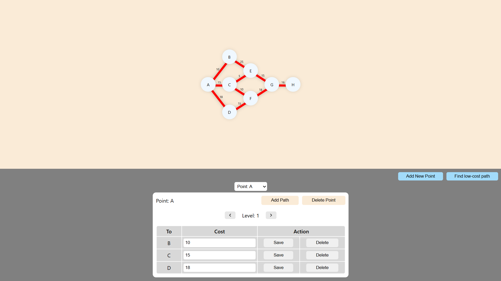
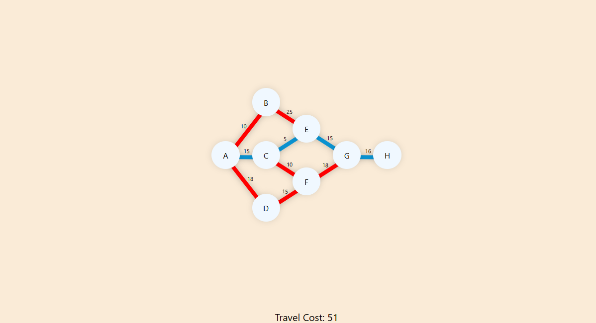

# DFS-Shortest-Path-Visualizer

A visual and interactive implementation of a **Depth-First Search (DFS)** based algorithm to find the **minimum cost path** in a **directed acyclic graph (DAG)**.

This tool helps understand how recursive DFS can be used to explore all paths and compute the shortest-cost route — with a clear, real-time graph visualization.

---

## 🧠 Algorithm Summary

This tool uses a **recursive DFS approach** to find the path with the **minimum total cost** from a given node by exploring all possible child paths and comparing costs.

---

## 🔗 Live Demo

👉 [Click here to try it out](https://mrabhin03.github.io/DFS-Shortest-Path-Visualizer/)  

---

## 🔍 Features

- 📌 Interactive graph traversal
- 🧠 Recursive DFS to compute minimum cost paths
- 🛣️ Highlights the path with the lowest total cost
- 📊 Real-time visual updates
- ⚡ Fully client-side (HTML/CSS/JavaScript)

---

## 📸 Screenshots

### Graph Visual

### Path Found


---

## 🚀 How to Run Locally

1. **Clone the repository**
   ```bash
   git clone https://github.com/mrabhin03/DFS-Shortest-Path-Visualizer.git
   ```

2. **Open `index.html` in your browser**


---

## 📜 License

**MIT License** — free to use and modify for personal or educational purposes.

---

## 👨‍💻 Author

Built by [**@mrabhin03**](https://github.com/mrabhin03)
If you found it useful, please ⭐ the repo!